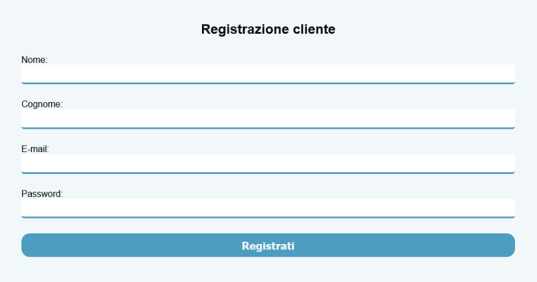
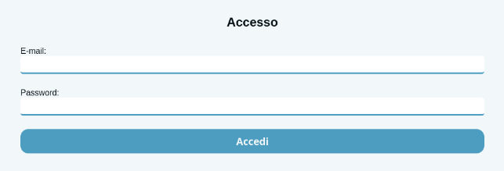
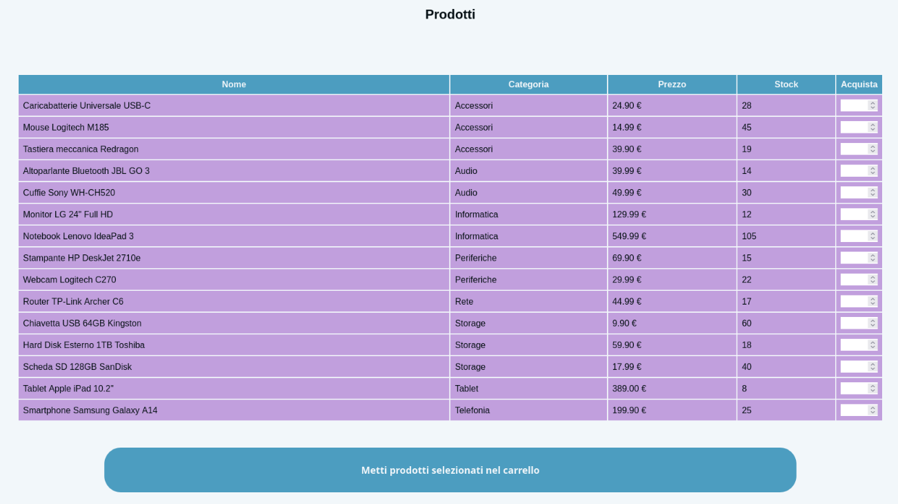
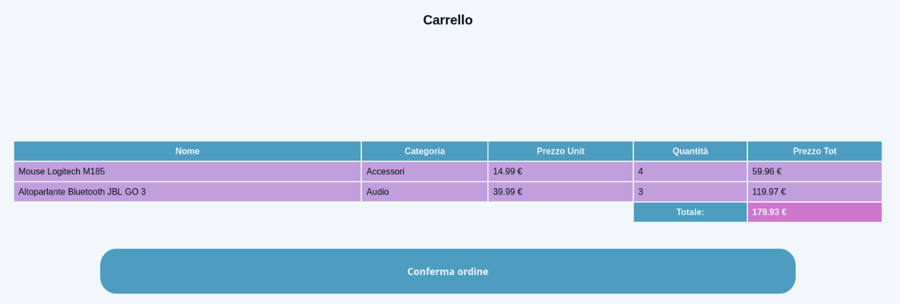

# Capolavoro a.s. 2024/2025
# Sito di ‘E-Commerce’
**Angela Montefusco**

## Descrizione
Il progetto è un prototipo di un sito web di E-Commerce 
realizzato per un compito scolastico. Il sito permette la gestione dei prodotti per gli amministratori, mentre per utenti registrati prevede l'acquisto dei prodotti.

---

## Struttura del progetto
```
/ECommerce-Project
├── /assets
├── /src
├── README.md
└── /database
```
- **/assets**: Contiene gli screenshot utilizzati in questa documentazione.
- **/src**: Codice sorgente del sito web (PHP, HTML, CSS, JavaScript).
- **README.md**: Documentazione del progetto.
- **/database**: Script SQL per creare il database.

---

### Tipi di utente:
- **Admin**: è l’amministratore del sistema, preregistrato dall’amministratore del database, può aggiungere prodotti, modificarli ed eliminarli.
- **Cliente**: si può registrare fornendo nome, cognome, email e password (in un progetto reale si richiede l’anagrafica completa).

### Stile
Tutte le pagine hanno uno stile comune, anche header e footer inclusi in ogni pagina, per rendere gli screenshot successivi più visibili allego qui come compaiono header e footer.


---

## Funzionalità

### Registrazione cliente
Gli admin vengono preregistrati nel sistema dall’amministratore del database, mentre gli utenti si possono registrare in maniera autonoma tramite un form.


### Login
Il login si può effettuare come Cliente o Admin tramite una pagina singola, prima verifica se l’email inserita è di un admin, se non lo è controlla tra gli utenti.



---

## Funzioni admin

### Gestione Prodotti
Viene mostrata la tabella dei prodotti con la possibilità di modificare o eliminare i prodotti cliccando le icone apposite.


### Modifica Prodotto
Viene mostrato un form nel quale vengono visualizzati i valori attuali del prodotto, permettendone la modifica.


### Elimina Prodotto
Richiede la conferma di eliminazione del prodotto onde evitare errori.


---

## Funzioni del Cliente

### Scelta dei prodotti da inserire del carrello
Viene visualizzata una tabella che consente di scegliere la quantità dei prodotti da inserire nel carrello, con il limite dei prodotti disponibili (ad es. se nel magazzino ce ne sono 100 di un certo prodotto, il cliente non potrà ordinarne 101).


### Carrello
Vengono visualizzati i prodotti scelti e il totale della spesa, per modificare i prodotti e quantità desiderate occorre ritornare alla pagina precedente.


---
## Come eseguire il progetto
1. Clona o scarica il progetto.
2. Configura il database con `/database/init.sql`.
3. Avvia il server locale con XAMPP/LAMP.
4. Accedi come admin o cliente (negli account inseriti da init.sql la password è '1').
